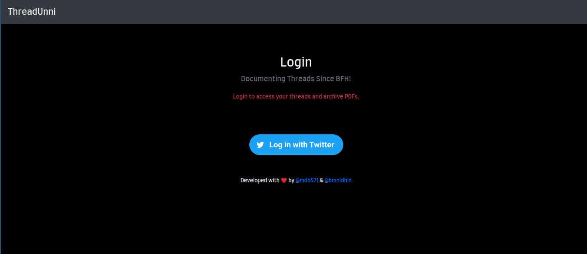
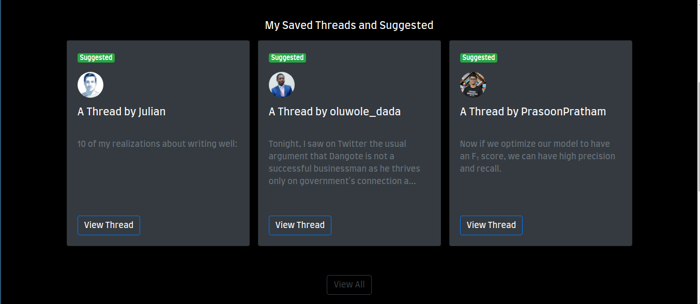
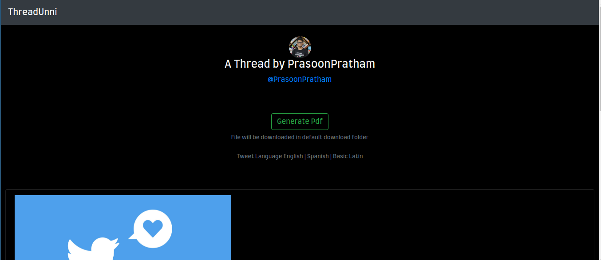
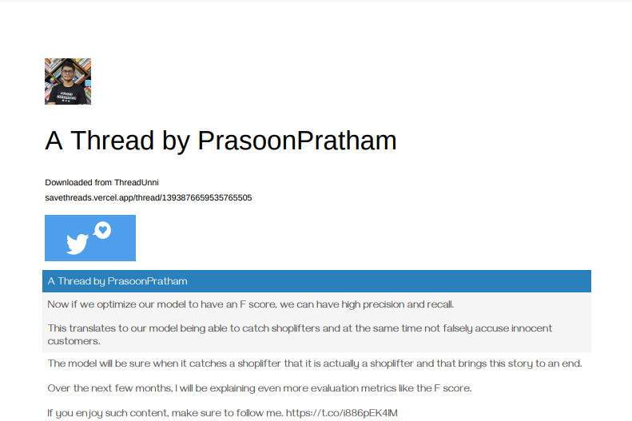
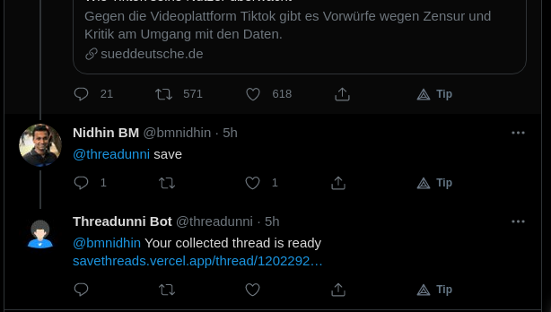

<h1 align="center">Threadunni</h1>

Open source web app and twitter bot that lets you read threads more easily and document them

  

<h3 align="center">Made by <a href="https://github.com/mdb571">@mdb571⚡</a> & <a href="https://github.com/bmnidhin">@bmnidhin:rocket:</a></h3>

## Features
- Pull tagged threads from twitter using [twitter](https://developer.twitter.com/en/docs/twitter-api) API
- Read and Save threads as a blog post
- Download threads as a PDF
- Social Login Using Twitter

## Setup
### Frontend
- Install the required npm packages with `npm install`
- Start development server `yarn start` or `react-scripts start`
  Open [http://localhost:3000](http://localhost:3000) to view it in the browser.
- Build with `yarn build`
  Builds the app for production to the `build` folder 
### Backend 
- Install the required python libraries `pip install -r requirements.txt`
- Run the bot with `python manage.py bot`
- run the server with `python manage.py runserver`
- Now you can start sending requests from the frontend to the backend API

[live demo](https://savethreads.vercel.app) 
## Screenshots
Homepage

  

 
Profile

  

 
Thread

  

 

Document (PDF)

  

 

Bot in action !

  

## Contributing and Support

Feel free to open a pull request if you can help in improving this project.

## Credits

- [threadreaderapp](https://threadreaderapp.com)
- Nikhil Verma for his [article](https://lih-verma.medium.com/mining-really-long-twitter-messages-threads-569d42bc0e1c)
- tinkerhub [BFH](https://tinkerhub.org/bfh)

## Show your support

Give a ⭐️ if this project helped you!❤️

## Licence

Code released under the [GPL](LICENSE).
